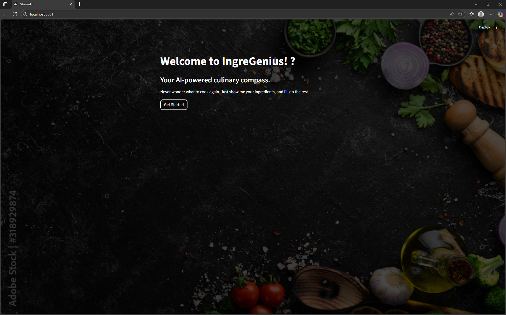
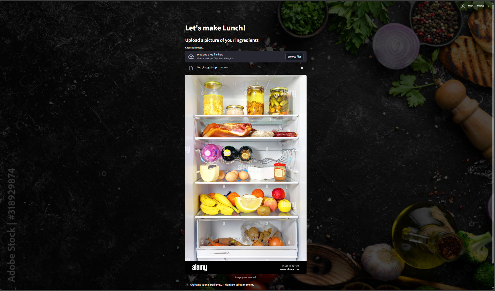
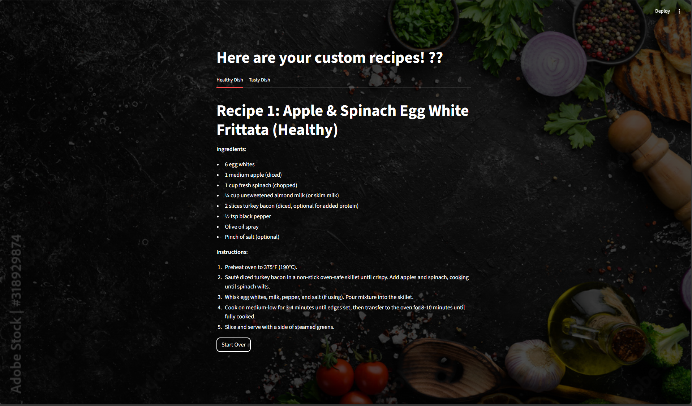
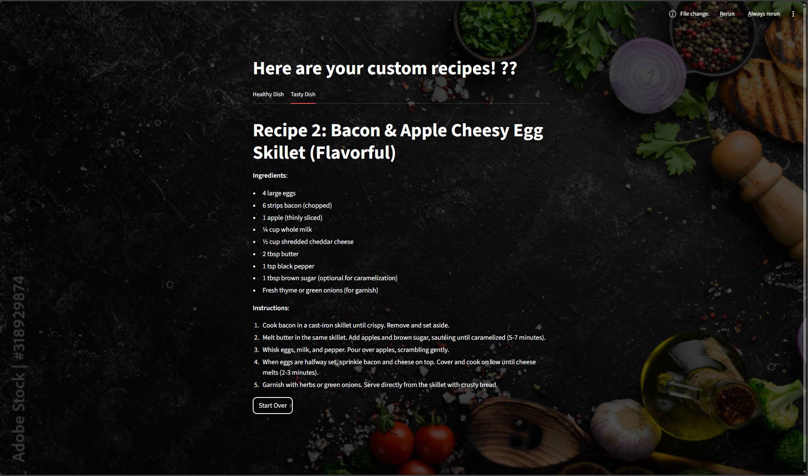

# Results or Output

This page showcases the results of the IngreGenius project with images and descriptions of its functionality.

## User Interface
- Example of the user-friendly Streamlit interface:
  
  

## Ingredient Detection
- Example of the YOLOv8 model detecting ingredients from an uploaded image:
  
  

## Generated Recipe
- Example of a recipe generated by the Deepseek LLM based on detected ingredients:
  
  

  
